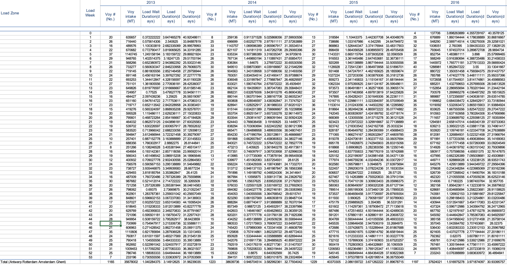
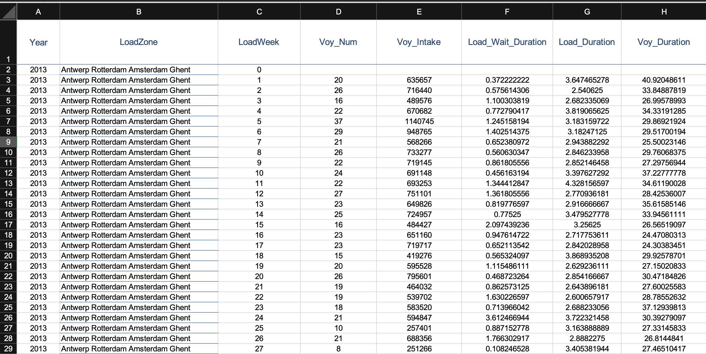
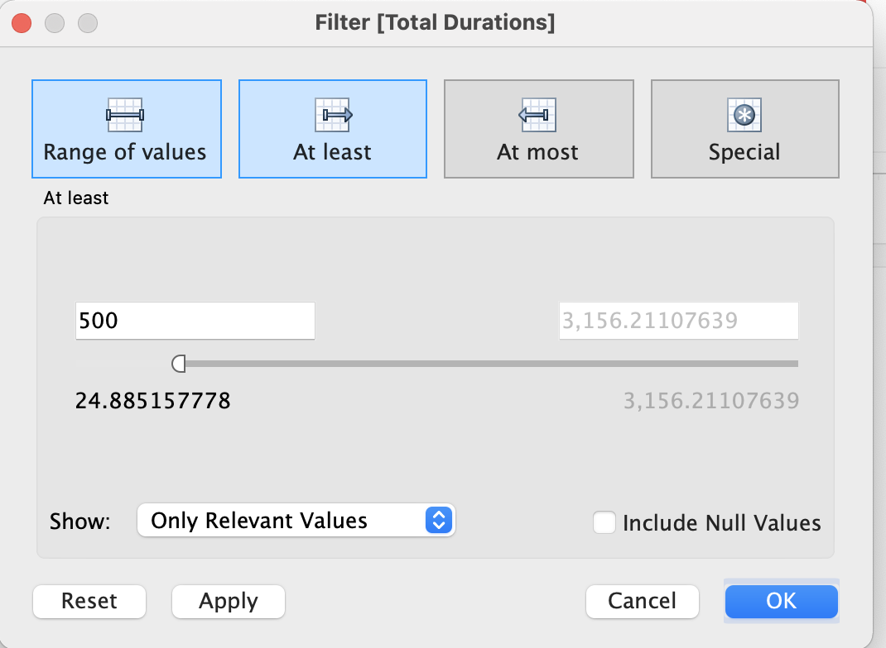

# Marine Transportation Data Analysis and Visualization

#### Author: Kyle Chen - 陳證皓

#### Process:
Before data cleansing:

What I did:
- Drop the columns & rows that are showing the TOTAL values, because these can be easily calculated using the aggregate function (e.g. **SUM**)
- Move the row that are representing YEAR into a new column
- Assign each column to its LOAD ZONE

After data cleansing:

#### Visualization using **Tableau**
[Link to the VIS](https://public.tableau.com/views/MarineTransportation/Dashboard1?:language=en-US&:display_count=n&:origin=viz_share_link)

- **Create Group** on "Load Week" column to turn weeks into seasons,
  - Week 0-12  => Spring
  - Week 13-26 => Summer
  - Week 27-40 => Fall
  - Week 41-53 => Winter

- In the chart of Busiest Ship, a filter is applied,
  - only ships with above 500 total duration days in the selected year is displayed.

